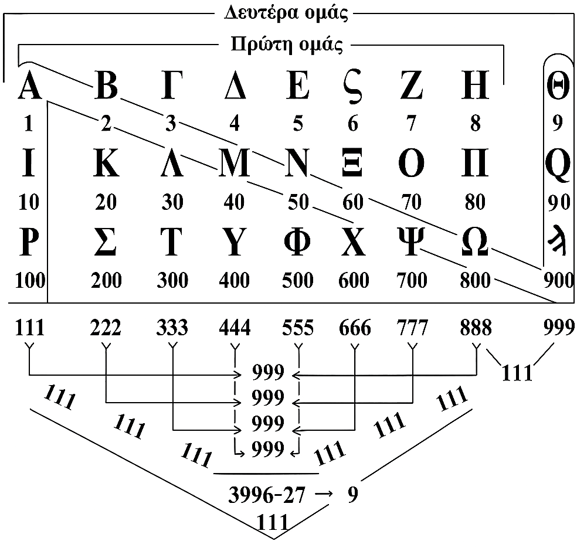

# lexarithmos-core

Core lexarithmic calculation library for Greek isopsephy (gematria).

<p align="center">
  
</p>

## What is Isopsephy?

**Isopsephy** (Greek: ἰσοψηφία, "equal pebbles") is the ancient Greek practice of assigning numerical values to letters. Each letter of the Greek alphabet corresponds to a number, and the sum of letter values in a word gives its **lexarithmic value** (λεξάριθμος).

This system was used by ancient Greeks for numerology, cryptography, and finding hidden connections between words with equal values (e.g., ΙΗΣΟΥΣ = 888).

## Installation

```bash
npm install lexarithmos-core
```

## Quick Start

```typescript
import { lexarithm } from 'lexarithmos-core';

const result = lexarithm('Ἀθήνα');
console.log(result);
// {
//   original: "Ἀθήνα",
//   normalized: "ΑΘΗΝΑ",
//   values: [1, 9, 8, 50, 1],
//   sum: 69,
//   reduced: 6,
//   steps: [{ value: 15, expression: "6 + 9 = 15" }, { value: 6, expression: "1 + 5 = 6" }]
// }
```

## Features

- Greek text normalization (accents, final sigma, case)
- Lexarithm calculation using ancient Greek numeral values
- Digit sum reduction to single digit (1-9)
- Optional master numbers support (11, 22, 33)
- Mathematical operations between lexarithm values
- Number properties detection (prime, Fibonacci, perfect square, etc.)
- Symbolic meanings for reduced numbers

## Greek Letter Values

The library uses the ancient Greek numeral system (isopsephy):

| Units (1-9) | Tens (10-90) | Hundreds (100-900) |
|-------------|--------------|---------------------|
| Α = 1 | Ι = 10 | Ρ = 100 |
| Β = 2 | Κ = 20 | Σ = 200 |
| Γ = 3 | Λ = 30 | Τ = 300 |
| Δ = 4 | Μ = 40 | Υ = 400 |
| Ε = 5 | Ν = 50 | Φ = 500 |
| Ϛ = 6 (stigma) | Ξ = 60 | Χ = 600 |
| Ζ = 7 | Ο = 70 | Ψ = 700 |
| Η = 8 | Π = 80 | Ω = 800 |
| Θ = 9 | Ϟ = 90 (koppa) | Ϡ = 900 (sampi) |

The archaic letters **Ϛ** (stigma), **Ϟ** (koppa), and **Ϡ** (sampi) are included for historical accuracy.

## API Reference

### Main Function

#### `lexarithm(text, ruleset?)`

Calculate the lexarithm value of Greek text.

```typescript
import { lexarithm } from 'lexarithmos-core';

// Basic usage
const result = lexarithm('ΙΗΣΟΥΣ');
// result.sum = 888
// result.reduced = 6

// With master numbers enabled
const result2 = lexarithm('ΒΘ', { reduction: { masterNumbers: true } });
// result2.sum = 11
// result2.reduced = 11 (stops at master number)

// With custom letter values
const result3 = lexarithm('ABC', { values: { A: 1, B: 2, C: 3 } });
```

### Greek Utilities

```typescript
import { normalizeGreek, GREEK_VALUES } from 'lexarithmos-core';

// Normalize Greek text
normalizeGreek('Ἀθήνα'); // "ΑΘΗΝΑ"
normalizeGreek('λόγος'); // "ΛΟΓΟΣ"

// Access letter values
GREEK_VALUES['Α']; // 1
GREEK_VALUES['Ω']; // 800
```

### Math Operations

```typescript
import { operate, partialReduction, finalReduction } from 'lexarithmos-core';

// Operations between values
operate(888, 666, 'add');      // { result: 1554, ... }
operate(888, 666, 'subtract'); // { result: 222, ... }
operate(888, 666, 'multiply'); // { result: 591408, ... }
operate(888, 666, 'divide');   // { result: 1.333..., ... }
operate(888, 666, 'ratio');    // { result: 1.333..., ... }

// Reduction
partialReduction(888);  // 24 (8+8+8)
finalReduction(888);    // 6 (8+8+8=24, 2+4=6)
```

### Number Properties (Extended)

For full number properties, import from the properties submodule:

```typescript
import {
  isPrime,
  isFibonacci,
  isPerfectSquare,
  isPerfectNumber,
  isTriangular,
  isPowerOfTwo,
  getNumberInfo,
  getSymbolicMeaning,
  SYMBOLIC_MEANINGS,
} from 'lexarithmos-core/properties';

// Check properties
isPrime(7);           // true
isFibonacci(13);      // true
isPerfectSquare(16);  // true
isPerfectNumber(6);   // true
isTriangular(10);     // true
isPowerOfTwo(8);      // true

// Get all info about a number
getNumberInfo(888);
// [{ icon: "☦", text: "ΙΗΣΟΥΣ στα ελληνικά...", type: "mystical" }]

// Get symbolic meaning for reduced numbers (0-9)
getSymbolicMeaning(7);
// { title: "Επτάδα", short: "Πνευματική Ολοκλήρωση...", ... }
```

## Reduction

By default, numbers are reduced to a single digit (1-9) through recursive digit summing:

```
888 → 8+8+8 = 24 → 2+4 = 6
```

Master numbers (11, 22, 33) are **not** preserved by default. To enable:

```typescript
lexarithm('...', { reduction: { masterNumbers: true } });
```

## TypeScript

Full TypeScript support with exported types:

```typescript
import type {
  LexarithmResult,
  Ruleset,
  ReductionOptions,
  OperationType,
  OperationResult,
  NumberPropertyInfo,
  SymbolicMeaning,
} from 'lexarithmos-core';
```

## Web Application

This library powers **[lexarithmos.org](https://lexarithmos.org)**, a web application that provides:

- Interactive lexarithm calculator with real-time results
- **Expression support** with full operator precedence (`+`, `-`, `*`, `/`, `^`)
- **Parentheses** for grouping: `(ΛΟΓΟΣ + ΘΕΟΣ) * 2`
- Reverse lookup: find all Greek words with a specific lexarithmic value
- Wildcard search with `*` and `?` patterns
- Mathematical and mystical number properties
- Detailed symbolic analysis for reduced numbers

## Disclaimer

This library is provided for educational and research purposes only. The lexarithmic (isopsephy) system is an ancient numerological practice with historical and cultural significance. The symbolic meanings and mystical interpretations included in this library are based on traditional sources and should not be considered as factual claims or used for decision-making purposes.

The developers make no claims about the validity or accuracy of numerological interpretations. Use at your own discretion.

Symbolic meanings are presented as traditional or cultural interpretations and are not scientific claims.

## License

MIT
